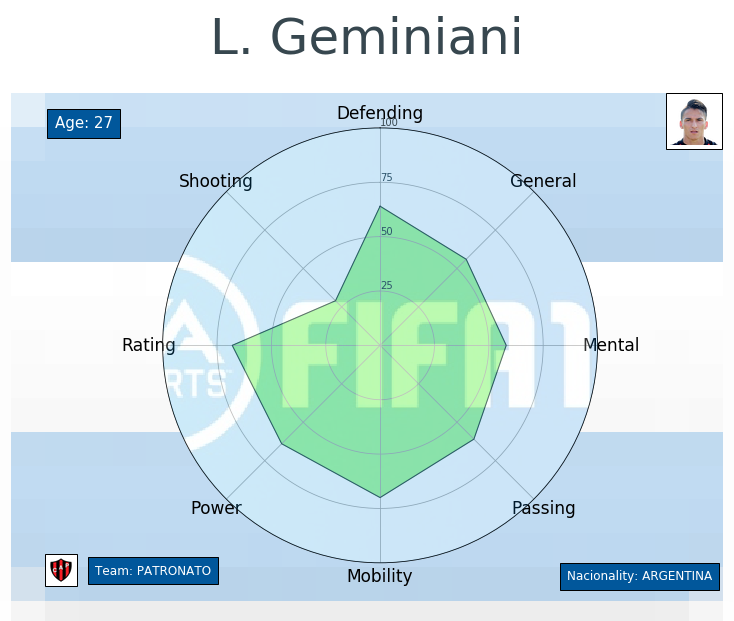
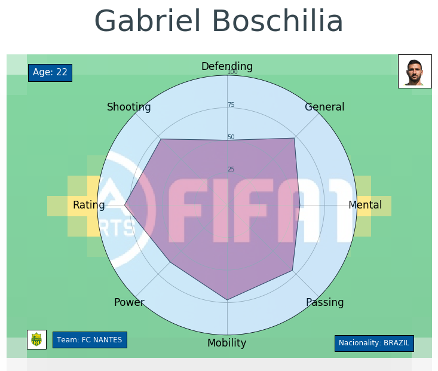

# Grafica Polar Fifa 2019 DataSet Kaggle


## ***DATASET***: [FIFA 19 complete player dataset created by Karan Gadiya](https://www.kaggle.com/karangadiya/fifa19)

## IMPORTS

```
import matplotlib
import matplotlib.pyplot as plt
import matplotlib.image as mpimg
from matplotlib.offsetbox import (OffsetImage,AnnotationBbox)
import pandas as pd
import numpy as np
from math import pi
import requests
from time import time
from datetime import datetime, timedelta
import random
```

## NEW CATEGORIES

New categories are created by joining player statistics and obtaining the average.
For example, to obtain the strength of the player join the balance, jump, stamina and strength and the average of each of them is obtained a general average that transforms into the ***Power*** column

```
def power(players):
    return int(round((players[['Balance', 'Jumping', 'Stamina', 
                               'Strength']].mean()).mean()))

players['Power'] = players.apply(power, axis=1)
```

## DIVISION OF CURRENT FEATURES TO GENERATE THE NEW COLUMNS

- ***Defending*** = [Marking, StandingTackle, SlidingTackle]
- ***General*** = [HeadingAccuracy, Dribbling, Curve, BallControl]
- ***Mental*** = [Aggression, Interceptions, Positioning, Vision, Composure]
- ***Passing*** = [Crossing, ShortPassing, LongPassing]
- ***Mobility*** = [Acceleration, SprintSpeed, Agility, Reactions]
- ***Power*** = [Balance, Jumping, Stamina, Strength]
- ***Rating*** = [Potential, Overall]
- ***Shooting*** = [Finishing, Volleys, FKAccuracy, ShotPower, LongShots, Penalties]

## TYPE OF GRAPHIC

- Matplotlib Polar

The graphic contains the name of the player, his age, the team where he currently plays, the nationality, the photo, the image of the club logo, the flag of the country where he was born and the statistics that were created with the function.

To see the information just pass the id to the graphPolar function, this calls the detail function by passing everything necessary to create the graph and visualize it. This function can be put inside a loop to bring all the players that are needed.

The dataset has 17918 so you can pass an id from 0 to 17917.

## CREATION, DOWNLOAD AND VISUALIZATION OF IMAGES

When executing the function that creates the graph this will go through the variables to obtain through the url that we have passed the flag of the country where the player was born, the logo of the team where he plays and a photo of his face (***flag_image*** , ***player_image***, ***logo_image***). These images will be downloaded only once in the project folder, then they will be modified as the function is called again.

```
flag_image = "img_flag.jpg"
    
img_flag = requests.get(image).content
with open(flag_image, 'wb') as handler:
    handler.write(img_flag)
```


## DATA VISUALIZATION






## NEW

I create a new notebook with different visualization.
To see it enter to Grafica Modificada.ipynb


