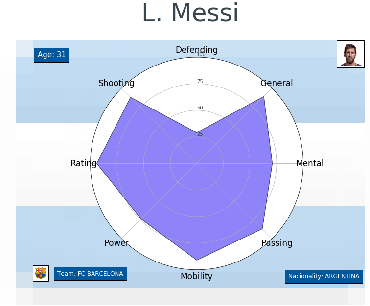
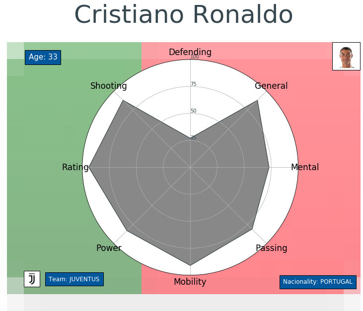
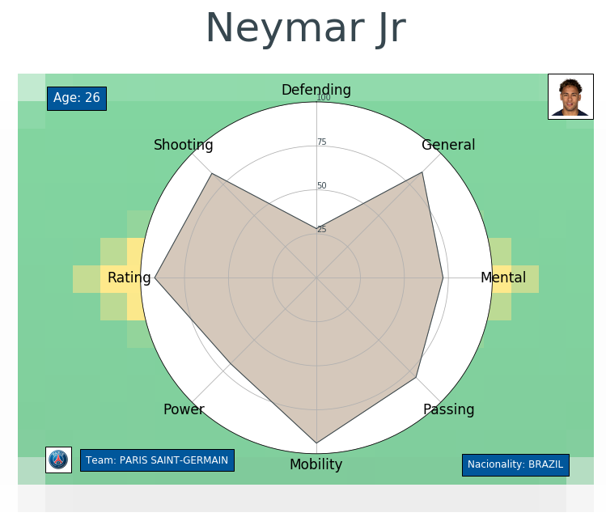
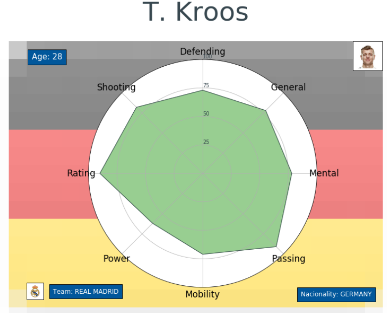

# Grafica Polar Fifa 2019 DataSet Kaggle

### ***DATASET***: [FIFA 19 complete player dataset created by Karan Gadiya](https://www.kaggle.com/karangadiya/fifa19)

### Imports

```
import matplotlib
import matplotlib.pyplot as plt
import matplotlib.image as mpimg
from matplotlib.offsetbox import (OffsetImage,AnnotationBbox)
import pandas as pd
import numpy as np
from math import pi
import requests
from time import time
from datetime import datetime, timedelta
import random
```

### New Categories

New categories are created by joining player statistics and obtaining the average.
For example, to obtain the strength of the player join the balance, jump, stamina and strength and the average of each of them is obtained a general average that transforms into the strength column

```
def power(players):
    return int(round((players[['Balance', 'Jumping', 'Stamina', 
                               'Strength']].mean()).mean()))

players['Power'] = players.apply(power, axis=1)
```


- ***Defending*** = [Marking, StandingTackle, SlidingTackle]
- ***General*** = [HeadingAccuracy, Dribbling, Curve, BallControl]
- ***Mental*** = [Aggression, Interceptions, Positioning, Vision, Composure]
- ***Passing*** = [Crossing, ShortPassing, LongPassing]
- ***Mobility*** = [Acceleration, SprintSpeed, Agility, Reactions]
- ***Power*** = [Balance, Jumping, Stamina, Strength]
- ***Rating*** = [Potential, Overall]
- ***Shooting*** = [Finishing, Volleys, FKAccuracy, ShotPower, LongShots, Penalties]

### Type of graphic

With these new features a new dataset is created from which the graph will be nourished

- Matplotlib Polar

### Data visualization




